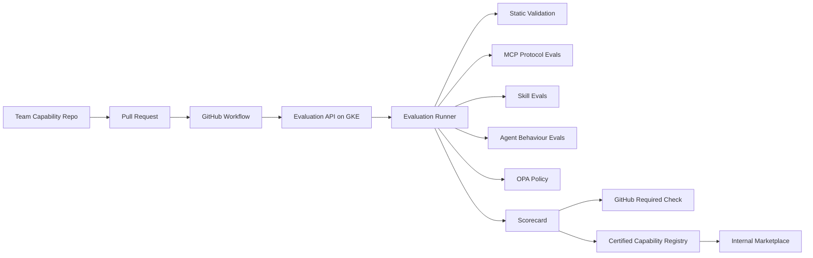

# Enterprise AI Capability Platform

## Purpose

Build an internal governed marketplace for AI capabilities:

- MCP servers
- Skills
- Agents
- Prompt packages
- Workflow packages
- Knowledge packs

The marketplace is not just a UI. It is an AI supply-chain control plane.

## Core Architecture

## Enterprise Rule

No AI capability is publishable unless:

- `marketplace.yaml` is valid
- ownership is clear
- risk and data classification are declared
- eval cases exist
- security checks pass
- destructive actions require human approval
- score is above threshold
- zero critical findings exist

